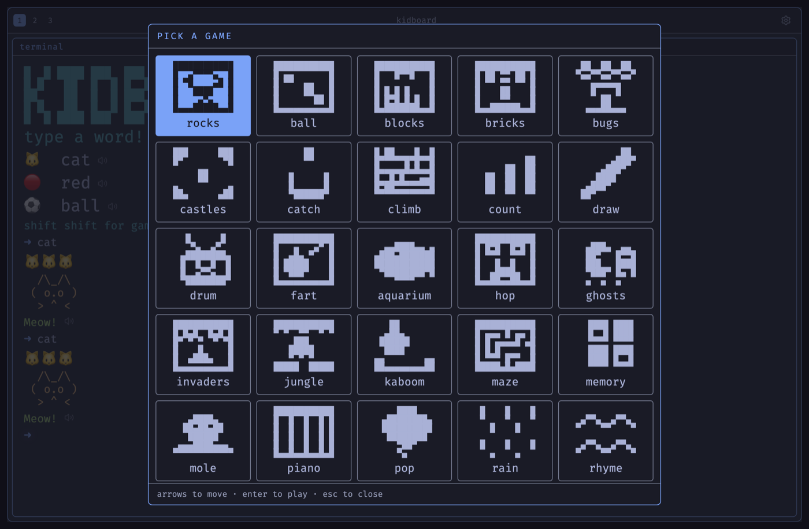
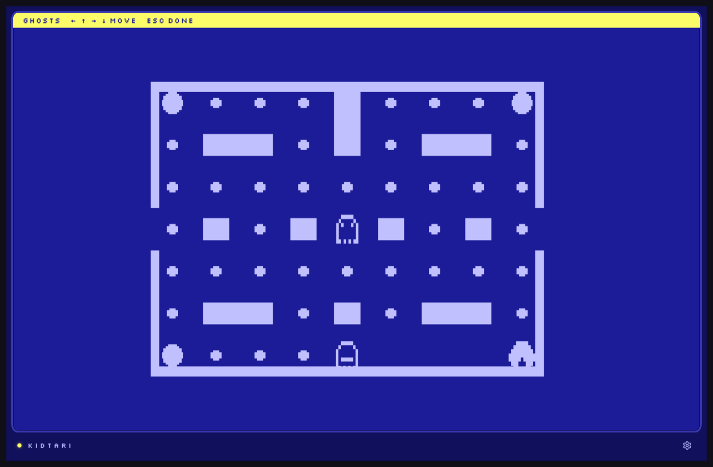

# Kidboard

[](https://github.com/jondot/kidboard/actions/workflows/ci.yml)

A terminal for six-year-olds. Type anything — a word, a name, a fistful of
letters — and something comes back. There is no error state, no score, and no
way to lose.

The point is the keyboard. A kid sitting next to a parent who lives in a
terminal wants the same thing the parent has, and what they usually get is a
tablet. Kidboard gives them the real object: a prompt, a blinking cursor,
their own keys. Bash out `qwertyuiop` and the machine makes a creature out of
it. Type `cat` and a cat shows up. Type `ghosts` and a maze opens. Every
keystroke pays, so the keys stop being scary and start being *theirs* — which
is the whole idea, and the only thing here that actually matters.

English and Hebrew, with full RTL.



## Install on Omarchy

```bash
curl -fsSL https://kidboard-app.vercel.app/install | bash
```

It lands in the app launcher (**Super + Space**) as a real web app, in a
frameless window, **wearing whatever theme your desktop is wearing** — all 22
Omarchy themes, read live at every launch, so change your theme and Kidboard
follows. Nothing is written outside `~/.local` and it needs no sudo. Remove it
with Super + Space → Remove → Web App.

[What that script actually does](docs/omarchy.md), if you'd rather run the two
commands yourself.

## Or just open it

<https://kidboard-app.vercel.app> — it is a web page, and needs nothing
installed to play.

## Four machines

A **theme** is a palette. A **system** is a whole machine — its typeface, its
frame, whether there is scrollback, and what happens to the screen when a game
starts. **Option, Option** picks a machine; **Ctrl, Ctrl** picks its colours;
**Shift, Shift** opens the games.

| | Kidtari | Kid Code | CRT | Omarchy |
|---|---|---|---|---|
| The window | a television set | a terminal window | a monochrome monitor | a tiling compositor |
| Prompt | `READY` | `❯` | `?` | `➜` |
| Scrollback | wiped on exit | kept forever | one surface, split | kept, in panes |
| A game starts by | taking the screen | opening inline | drawing in the field | opening a second window |
| Typeface | Silkscreen | JetBrains Mono | VT323 | Fira Code |
| Palettes | 3 | 2 | 3 phosphors | all 22 Omarchy themes |

They disagree about something behavioural, not cosmetic. The Kidtari says a
game is a mode and the past is gone. The CRT says nothing is ever gone and you
see the field and the words at once. Kid Code — a terminal shaped like the one
a grown-up works in — says keep everything and scroll. Omarchy has a window
*manager*, so a game is a second window that tiles beside the terminal.

**No raster effects.** The tube draws no scanlines, no interlace and no bloom.
Imitating a CRT's faults reproduces the one that makes small text hard to
read, and the child it is worst for is exactly the child this is built for.



## Run it yourself

```bash
npm install
npm run dev
```

`npm test` runs the suite (1,799 tests); `npm run build` type-checks and
bundles.

## Cartridges

Everything a child can type into is a **cartridge**, and there are 42 of them —
29 with a frame loop and a canvas, 5 typed conversations, 8 one-shots. A folder
in `src/cartridges/` registers itself just by existing; there is no central
list to edit.

Games draw filled and outlined shapes on a field of 8×8 logical pixels per
character cell, in the theme's ground plus **one ink**. No scores, no counters,
and nothing re-arms on a timer: a round ends when the child says it ends.

**Carts are portable.** A game can be saved as a PNG — a picture of a
cartridge, with grip ridges and connector fingers — and dropped back onto any
Kidboard, on any machine, by any child. Twenty-nine of the built-ins pack today.
`draw`, `piano` and `drum` hand back what a child *made* as a cart of its own,
which is the path that matters most and needs no reading at all.

Making one takes a file and a command:

```bash
npm run make-cart -- mygame.js --name pop --title "Pop!"
```

It refuses to write a cart that does not play — it bundles yours, runs it
through the real sandbox, and requires a first frame with drawing in it.

- [`docs/CARTS.md`](docs/CARTS.md) — the cart format, the Worker sandbox, and
  `make-cart` in full.
- [`docs/CARTRIDGE-API.md`](docs/CARTRIDGE-API.md) — the frozen `apiVersion: 1`
  interface.
- [`src/cartridges/README.md`](src/cartridges/README.md) — writing a built-in.
- [`docs/HEBREW.md`](docs/HEBREW.md) — the conventions every Hebrew string
  follows.

## Embedding

`<Kidboard />` is the entire public export, and it fills its container.

```tsx
import { Kidboard } from './src/Kidboard'

<Kidboard locale="he" />
```

| Prop | Type | Default | Notes |
|---|---|---|---|
| `locale` | `'en' \| 'he'` | last saved, else `'en'` | Also switchable at runtime by typing `english` / `hebrew` / `עברית` / `אנגלית`. |
| `seed` | `number` | random per mount | Seeds the RNG; pass one for deterministic demos and tests. |
| `className` | `string` | — | Passed through to the root element. |

Not published to npm — `package.json` is `private` with no `exports`, so
embedding means importing from a checkout.

## Credits

The 22 gallery palettes are Omarchy's own `colors.toml` files, copied verbatim
— MIT, © Basecamp / David Heinemeier Hansson —
[basecamp/omarchy](https://github.com/basecamp/omarchy). The four machine
typefaces come from Google Fonts in a single `@import`; every stack ends in
`ui-monospace, monospace`, so a blocked or offline host degrades to the
platform mono and nothing breaks.

## License

MIT. See [LICENSE](LICENSE).
